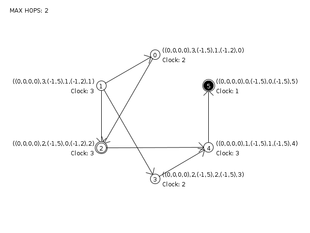

# Hierarchical Leader Election

Simulator of an Assynchronous Leader Election Algorithm for Dynamic Networks using the Akka framework for message passing and Processing for visualization.

**How to run it**

This project uses ant to build and run.

- Download or clone the repository
- java -jar dist/HierarchicalLeaderElection.jar to run the distribution
- ant build to compile locally
- ant dist to create a runnable distribution jar file
- ant run to run the program

**The start menu**

When the simulator starts it will open a setup menu so you can set the initial state of the network in a few steps:

- Defining the number of nodes in the network
- Defining the maximum number of hops allowed between a node and its local leader
- Choosing a local leader for each node
- Determining the number of hops between each node and its local leader
- Choosing the global leader
- Determining the number of hops between each node and the global leader

After completing these steps, the simulator is ready to run!
You should see a network similar to this:

- A node has its ID inside it and its height and local clock next to it
- A node with a circle around it is a local leader
- A black node is a global leader

**Dependencies**

- Akka-actor 2.12
- Akka-testkit 2.12
- com.typesafe.config 1.4
- scala-library 2.12
- Processing.core 3.3.7

All dependencies are included in the lib directory and bundled in the runnable jar

**For more information**

- Akka: https://akka.io/
- Processing: https://processing.org/
- The algorithm: [Paper describing the algorithm](SLR209-HierarchicalLeaderElection.pdf)
